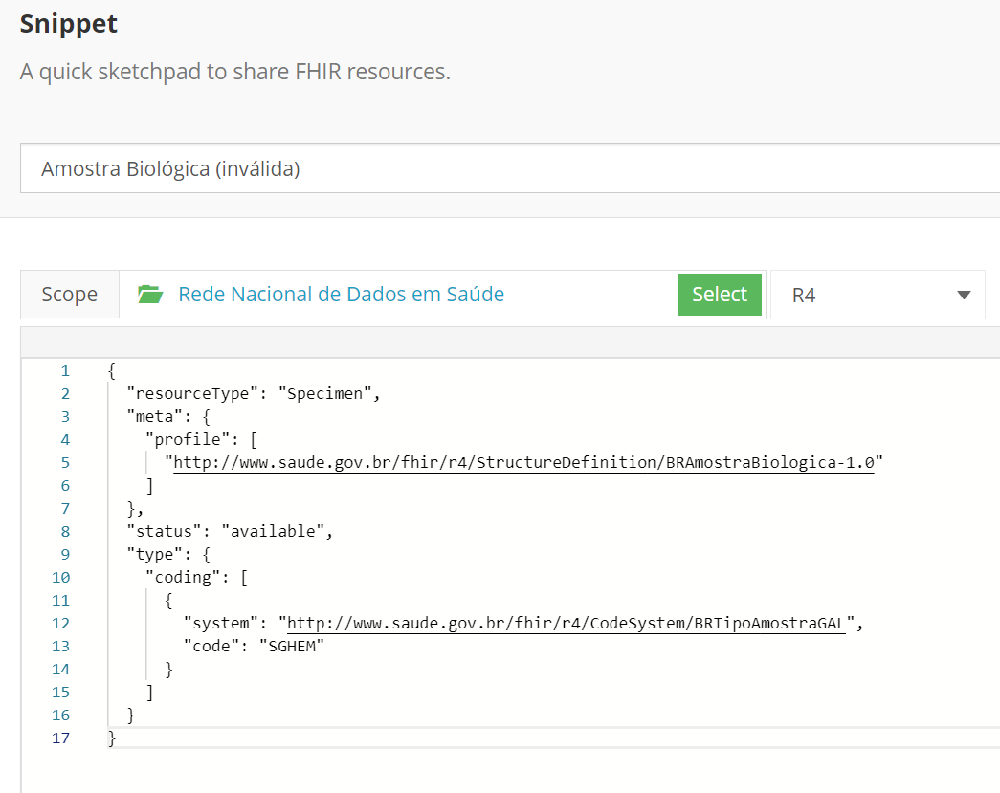
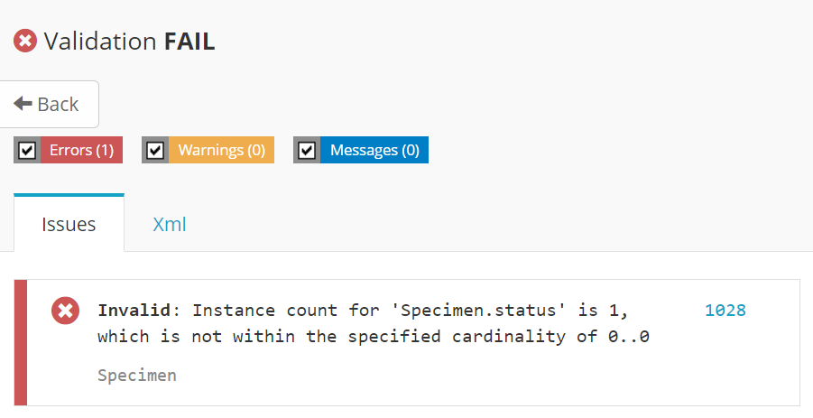
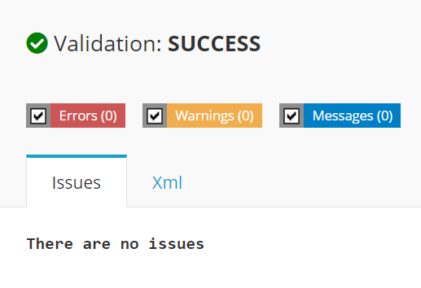

A validação visa assegurar que as informações criadas e/ou recebidas estão em conformidade com os perfis nacionais, além das exigências predefinidas pelo FHIR.

Vários [critérios](https://www.hl7.org/fhir/validation.html) podem ser considerados na validação de recursos FHIR, como a presença de elementos obrigatórios, a cardinalidade de coleções e outros.

## Onde encontrar as definições nacionais (perfis)?

Naturalmente, todas as definições nacionais devem ser do conhecimento de integradores e serem empregadas nas validações realizadas. Todas elas podem ser baixadas do [Portal de Serviços da RNDS](https://servicos-datasus.saude.gov.br/) ou ainda do Simplifier.Net, onde as definições da RNDS também estão [publicadas](https://simplifier.net/redenacionaldedadosemsaude).

:::info Detalhe Simplifier.Net
Canto superior direito, _Download_ e, na sequência,
_Zip valid resources as XML_. Baixe e descomprima o arquivo
em diretório a ser fornecido para a aplicação de validação (comentada posteriormente).
:::

## Recurso válido (e outro inválido)

Abaixo segue uma Amostra Biológica em conformidade com as restrições nacionais. Por curiosidade, "SGHEM" é o código para "sangue".

```json
{
  "resourceType": "Specimen",
  "meta": {
    "profile": [
      "http://www.saude.gov.br/fhir/r4/StructureDefinition/BRAmostraBiologica-1.0"
    ]
  },
  "type": {
    "coding": [
      {
        "system": "http://www.saude.gov.br/fhir/r4/CodeSystem/BRTipoAmostraGAL",
        "code": "SGHEM"
      }
    ]
  }
}
```

Um laboratório, ao construir uma Amostra Biológica, deve observar que o Brasil restringe o uso de vários elementos do recurso Specimen, dentre eles, _receivedTime_, utilizado para registrar o instante em que a amostra foi recebida para processamento e outros, além de _status_. Isto significa que uma Amostra Biológica, em conformidade com as especificidades nacionais, não deve conter o instante em que a amostra foi recebida, assim como também não deve conter o elemento _status_. A amostra acima satisfaz estas e outras restrições.

Uma Amostra Biológica com o elemento _status_, por exemplo, conforme ilustrada abaixo é, portanto, uma Amostra Biológica que não está em conformidade com as especificidades nacionais.

```json
{
  "resourceType": "Specimen",
  "meta": {
    "profile": [
      "http://www.saude.gov.br/fhir/r4/StructureDefinition/BRAmostraBiologica-1.0"
    ]
  },
  "status": "available",
  "type": {
    "coding": [
      {
        "system": "http://www.saude.gov.br/fhir/r4/CodeSystem/BRTipoAmostraGAL",
        "code": "SGHEM"
      }
    ]
  }
}
```

De fato, ao se tentar validar o recurso fornecido acima, o processo indica a presença do elemento _status_, definido para o recurso _Specimen_ conforme originalmente estabelecido pelo FHIR, mas excluído pela RNDS. A mensagem retornada pelo aplicativo gráfico claramente registra esta não conformidade:

Element 'Specimen.status': max allowed = 0, but found 1"

## Como validar um recurso?

É possível validar manualmente um recurso, sem apoio de um software. Contudo, não é uma alternativa prática. Felizmente há várias opções, que podem ser utilizadas conforme a necessidade que se tem.

### Interface gráfica

Um aplicativo gráfico é disponibilizado pelo [Portal de Serviços da RNDS](https://servicos-datasus.saude.gov.br/). Abaixo segue a tela deste aplicativo após a validação de um recurso.


No primeiro campo forneça o diretório contendo as definições nacionais (veja como obtê-las acima), depois indique a representação do recurso a ser validado no formato JSON e, por fim, clique no botão `Validar` para que a validação seja executada.

### Linha de comandos

Uma alternativa é o aplicativo de linha de comandos **validator_cli**.
Detalhes da instalação e opções disponíveis estão devidamente [documentadas](https://confluence.hl7.org/display/FHIR/Using+the+FHIR+Validator).

O comando abaixo ilustra como validar o recurso representado no formato JSON e depositado no arquivo **amostra.json**, considerando as definições contidas no diretório **d:\definicoes**.

```shell
java -jar validador_cli.jar amostra-invalida.json -ig d:\definicoes -recurse
```

Na saída padrão será exibida a mensagem

```
Specimen.status: max allowed = 0, but found 1
```

Há muitas opções, conforme a documentação indicada acima. Duas delas incluem `-output saida.json` para depositar a saída no arquivo indicado (neste caso, **saida.json**) e `-version 4.0.1` para indicar a versão do FHIR a ser considerada no processo de validação. Se não fornecido, a versão mais recente é empregada.

Por fim, a primeira execução inclui a obtenção de várias definições do FHIR, reutilizadas posteriormente e tornando o processo mais rápido.

### Simplifier.Net (também valida)

Além de publicar perfis FHIR, como feito pela RNDS, você também pode executar validações diretamente no portal, pelo navegador. Esta é uma opção particularmente útil para ambientação com o FHIR e com os perfis nacionais.

É preciso se cadastrar no [Simplifier.Net](https://simplifier.net/), felizmente, é gratuito.

Em sua conta, no canto superior direito encontra-se a opção `SNIPPET`.
Você pode empregar este recurso para compartilhar recursos FHIR e para validar tais recursos. Ao clicar nesta opção abre-se uma tela como aquela abaixo.



Observe que terá que indicar a versão, R4, e o escopo, neste caso, as definições da Rede Nacional de Dados em Saúde, conforme ilustrado.
Neste exemplo, por simplicidade é exeperimentado o recurso Specimen e,
em particular, o perfil nacional Amostra Biológica. Observe que foi
introduzido o elemento _status_, justamente para provocar um erro.

Pode-se então salvar o recurso e, na sequência, validar (canto superior direito), o que conduz ao resultado abaixo.



Observe que pode ser retornado ao modo edição e, se o elemento não permitido no perfil (_status_) é removido, uma nova validação resulta na imagem abaixo.


